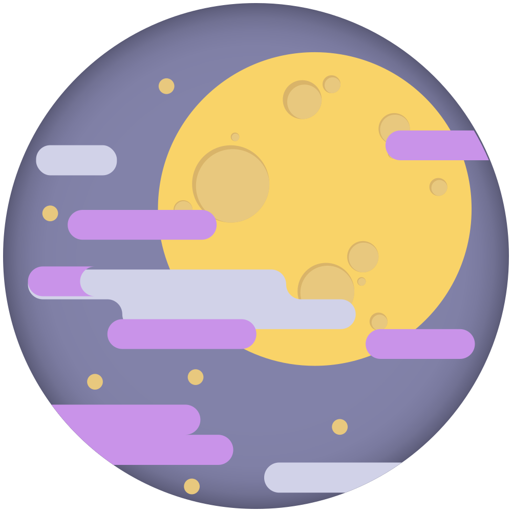
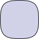
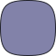
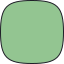
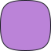
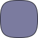
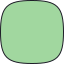
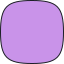
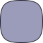

<div align="center">
  
  <h1>Moonbloom Dark Theme</h1>
  <p>Gentle on the eyes, evoking the cozy tranquility of a serene night.</p>
  <p>Designed to be unobtrusive during daily use while still being beautiful to work with.</p>
  <span><a href="https://moonbloom.teplostanski.dev">Website</a> • <a href="https://github.com/orgs/moonbloom-theme/discussions">Discussions</a> • <a href="https://donate.teplostanski.dev">Support Us</a></span>
</div>

A color theme for applications, terminals, and development tools inspired by the tranquility of nighttime, designed for comfortable, eye-friendly work.

Imagine customizing all your tools (Visual Studio Code editor, terminals like Alacritty or iTerm2, zsh shell, and other applications) with a unified, eye-pleasing color palette inspired by the serene atmosphere of nighttime.

The core mission of this project is to reduce eye strain during long coding sessions by creating a comfortable and cozy programming environment. Just as moonlight gently illuminates the night landscape, this theme provides a balanced color combination that helps you stay focused on your work without unnecessary eye fatigue.

## Basic Color Palette

| Palette    | Hex       | RGB             | HSL             |                                          |
| ---------- | --------- | --------------- | --------------- | ---------------------------------------- |
| Background | `#1D1E27` | `29, 30, 39`    | `234, 15%, 13%` |  |
| Foreground | `#D1D2E8` | `209, 210, 232` | `237, 33%, 86%` |  |
| Comment    | `#8282A9` | `130, 130, 169` | `240, 18%, 59%` |     |
| Cyan       | `#4FA8B8` | `79, 168, 184`  | `189, 43%, 52%` |        |
| Blue       | `#5A9BCF` | `90, 155, 207`  | `207, 55%, 58%` |        |
| Green      | `#93C591` | `147, 197, 145` | `118, 31%, 67%` |       |
| Magenta    | `#BB83D8` | `187, 131, 216` | `280, 52%, 68%` |     |
| Purple     | `#8483D8` | `132, 131, 216` | `241, 52%, 68%` |      |
| Red        | `#E66D75` | `230, 109, 117` | `356, 71%, 66%` |         |
| Yellow     | `#D9B469` | `217, 180, 105` | `40, 60%, 63%`  |      |

## Accessibility [](https://www.w3.org/TR/WCAG21/#contrast-minimum)

All primary text colors have a contrast ratio of `4.5:1` or higher against the default background `#1D1E27`, meeting [WCAG 2.1 | Level AA](https://www.w3.org/TR/WCAG21/#contrast-minimum) standards. The only exceptions are colors intentionally designed to be subtle, such as `Comment` and `Disabled`.

## Expanded Color Palette

| Palette            | Hex       |                                              | WCAG bg 500 | DEFAULT    | 300        | 200       | 100       |
| ------------------ | --------- | -------------------------------------------- | ----------- | ---------- | ---------- | --------- | --------- |
| Background 100     | `#3D3D50` |  | -           | -          | -          | -         | -         |
| Background 200     | `#323242` |  | -           | -          | -          | -         | -         |
| Background 300     | `#292936` |  | -           | -          | -          | -         | -         |
| Background DEFAULT | `#1D1E27` |  | -           | -          | -          | -         | -         |
| Background 500     | `#191A21` |  | -           | -          | -          | -         | -         |
| Border             | `#3F3F52` |      | -           | -          | -          | -         | -         |
| Foreground         | `#D1D2E8` |      | 11.64:1 👍  | 11.12:1 👍 | 9.62:1 👍  | 8.44:1 👍 | 7.11:1 👍 |
| Comment            | `#8282A9` |         | 4.72:1 👍   | 4.51:1 👍  | 3.90:1     | 3.42:1    | 2.88:1    |
| Disabled           | `#7B7B9F` |        | 4.27:1      | 4.08:1     | 3.53:1     | 3.10:1    | 2.61:1    |
| Cyan               | `#4FA8B8` |            | 6.30:1 👍   | 6.02:1 👍  | 5.21:1 👍  | 4.56:1 👍 | 3.85:1    |
| Cyan bright        | `#68C7D6` |     | 8.86:1 👍   | 8.47:1 👍  | 7.32:1 👍  | 6.42:1 👍 | 5.41:1 👍 |
| Blue               | `#5A9BCF` |            | 5.80:1 👍   | 5.54:1 👍  | 4.80:1 👍  | 4.20:1    | 3.54:1    |
| Blue bright        | `#6EB4E0` |     | 7.65:1 👍   | 7.31:1 👍  | 6.33:1 👍  | 5.55:1 👍 | 4.68:1 👍 |
| Green              | `#93C591` |           | 8.78:1 👍   | 8.39:1 👍  | 7.26:1 👍  | 6.37:1 👍 | 5.37:1 👍 |
| Green bright       | `#A1D79F` |    | 10.52:1 👍  | 10.05:1 👍 | 8.70:1 👍  | 7.62:1 👍 | 6.43:1 👍 |
| Magenta            | `#BB83D8` |         | 6.07:1 👍   | 5.80:1 👍  | 5.02:1 👍  | 4.40:1    | 3.71:1    |
| Magenta bright     | `#C993E9` |  | 7.29:1 👍   | 6.97:1 👍  | 6.03:1 👍  | 5.29:1 👍 | 4.46:1    |
| Purple             | `#8483D8` |          | 5.14:1 👍   | 4.91:1 👍  | 4.25:1     | 3.72:1    | 3.14:1    |
| Purple bright      | `#9291DC` |   | 6.03:1 👍   | 5.77:1 👍  | 4.99:1 👍  | 4.37:1    | 3.69:1    |
| Red                | `#E66D75` |             | 5.62:1 👍   | 5.37:1 👍  | 4.65:1 👍  | 4.08:1    | 3.44:1    |
| Red bright         | `#F17C88` |      | 6.59:1 👍   | 6.30:1 👍  | 5.45:1 👍  | 4.78:1 👍 | 4.03:1    |
| Yellow             | `#D9B469` |          | 8.82:1 👍   | 8.43:1 👍  | 7.29:1 👍  | 6.39:1 👍 | 5.39:1 👍 |
| Yellow bright      | `#E8C87E` |   | 10.73:1 👍  | 10.25:1 👍 | 8.87:1 👍  | 7.78:1 👍 | 6.56:1 👍 |
| Gray               | `#9B9BBA` |            | 6.43:1 👍   | 6.15:1 👍  | 5.32:1 👍  | 4.66:1 👍 | 3.93:1    |
| Gray bright        | `#E1E2ED` |     | 13.46:1 👍  | 12.86:1 👍 | 11.13:1 👍 | 9.76:1 👍 | 8.23:1 👍 |

## Clone repo

```sh
git clone --recurse-submodules https://github.com/moonbloom-theme/moonbloom.git
```

## Maintainer

<table>
  <tr>
    <td align="center">
      <a href="https://github.com/teplostanski" title="Игорь Теплостанский">
        
      <br /><sub><b>Игорь Теплостанский</b></sub>
      </a>
    </td>
  </tr>
</table>

## License

[MIT License](./LICENSE) © Moonbloom Theme
